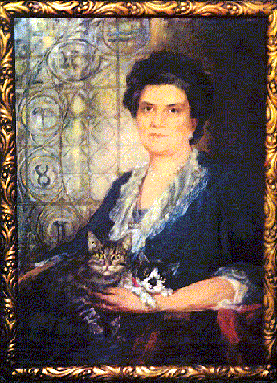

... wurde 1927 in Wien – nach dem Vorbild der um 45 Jahre älteren britischen [SPR](http://www.spr.ac.uk/) (Society for Psychical Research) – als „Österreichische Gesellschaft für Psychische Forschung“  gegründet. 1946 nach dem Krieg wiederbegründet, wurde die Gesellschaft bald als Mitglied in den „Notring der wissenschaftlichen Gesellschaften Österreichs“ (heute: „[Verband der wissenschaftlichen Gesellschaften Österreichs](http://www.vwgoe.at/)“) aufgenommen. Im Jahre 1971 wurde der Name der Gesellschaft  auf „Österreichische Gesellschaft für Parapsychologie“ geändert; 1997 wurde der Zusatz „Grenzbereiche der Wissenschaften“ dem Namen hinzugefügt, um die interdisziplinäre Vernetzung mit Nachbarbereichen zu betonen sowie dem internationalen Trend zur Integration in eine (im Entstehen begriffene) „[Anomalistik](http://www.anomalistik.de/ano.pdf)“ zu entsprechen.

Der Motor hinter der Gründung einer Gesellschaft zum Studium der parapsychologischen Phänomene war 

**Gräfin Zoë Wassilko-Serecki**,

aus deren Studienkreis rund um das rumänische Spukmedium Eleonore Zugun diese Gesellschaft direkt hervorgegangen ist; zum ersten Präsident wurde Univ.-Prof. Dr. Hans Thirring (Institut für Theoretische Physik der Universität Wien) gewählt, der bereits seit 1924 mit „physikalischen Medien“ experimentiert hatte. Die Jahre von der Gründung bis zum „Anschluß“ von 1938 waren außerordentlich fruchtbar; die Gesellschaft war – vor allem dank der Aktivität der Generalsekretärin, Gräfin Wassilko – in die internationale parapsychologische Szene voll integriert, sie war experimentell orientiert und zahlreiche ihrer führenden Mitglieder, z. B. der Psychoanalytiker Dr. Alfred Baron Winterstein, sind mit Publikationen an die Öffentlichkeit getreten.   (Vgl. auch „Details zur Geschichte und Vorgeschichte der Österreichische Gesellschaft für Parapsychologie, Dokumente dazu“.)

Nach der Unterbrechung durch die NS-Herrschaft und den Krieg konnte aufgrund des Paradigmenwechsels der Parapsychologie zur Rhine'schen Schule der Anschluß an diese glanzvolle Vergangenheit aktiver experimenteller Forschung nicht mehr gefunden werden; der Focus liegt seither auf der Öffentlichkeitsarbeit. Über drei Jahrzehnte, bis 1997, hatte Univ.-Prof. Dr. Hellmut Hofmann (Institut für Grundlagen und Theorie der Elektrotechnik, Technische Universität Wien) das Präsidium inne.  Insbesondere das Auftreten von Uri Geller anfangs der Siebzigerjahre brachte eine Welle erhöhten Interesses (und auch mancher Forschungsaktivität), die aber mittlerweile wieder auf das vorherige Maß abgeebbt ist. Die Aktivitäten liegen gegenwärtig insbesondere in Vortragsveranstaltungen für Mitglieder und Gäste und im Betrieb einer Bibliothek; einige Mitglieder führen eigene Experimente durch und es gibt auch eine "Experimentelle Arbeitsgruppe".  Derzeit umfaßt die Österreichische Gesellschaft für Parapsychologie mehr als 100 Mitglieder, wobei noch ca. 350 vorgemerkte Interessenten hinzukommen. Auf den elektronischen Newsletter waren ca. 950 Personen aus der ganzen Welt abonniert; diese Zahl ist nunmehr wegen des opt-in-Verfahrens aufgrund der DSGV auf ca. 300 gesunken.

Im Sommer 2000 wurde der Sitz der Gesellschaft, der sich über 30 Jahre lang an der TU befunden hatte, an die Universität Wien verlegt (Institut für Kultur- und Sozialanthropologie der Universität Wien), wo er bis kurz nach dem Ableben von Prof. Kremser verblieben ist (mittlerweile interimistisch verlegt).

My name is Inigo Montoya. I have the following qualities:

- I rock a great mustache
- I'm extremely loyal to my family

What else do you need?

### My story

To be honest, I'm having some trouble remembering right now, so why don't you just watch [my movie](https://en.wikipedia.org/wiki/The_Princess_Bride_%28film%29) and it will answer **all** your questions.
